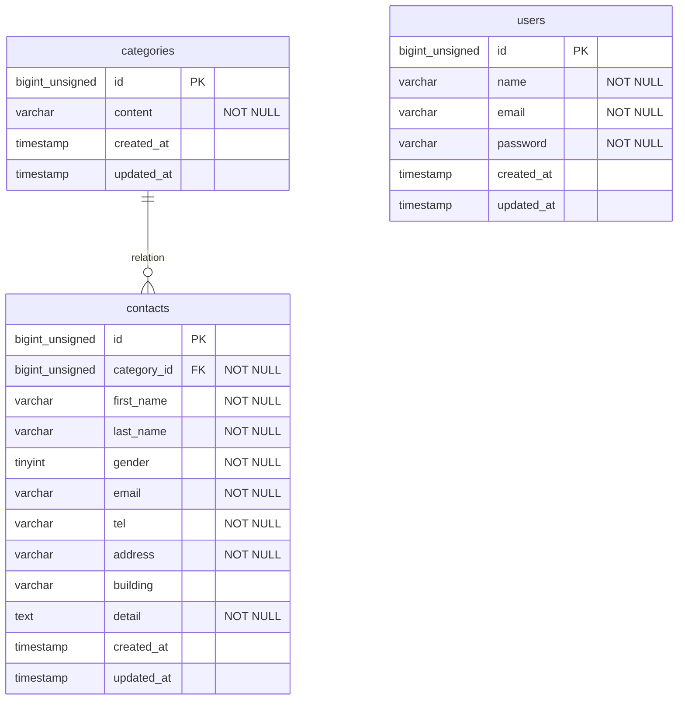

## アプリケーション名

* お問い合わせ管理システム

## 環境構築

***Dockerビルド**

* git clone git@github.com:sappy3105/contact-form-test.git  
* docker-compose up -d --build  

**Laravel環境構築**

* docker-compose exec php bash
* composer install
* cp .env.example .env , 環境変数を適宜変更
* php artisan key:generate
* php artisan migrate
* php artisan db:seed

## 開発環境

* お問い合わせ画面： http://localhost/
* ユーザー登録： http://localhost/register
* ユーザーログイン： http://localhost/login
* phpMyAdmin： http://localhost:8080/

## 使用技術（実行環境）

* PHP 8.1.34
* Laravel 8.83.29
* MySQL 8.0.26
* nginx 1.21.1
* phpMyAdmin 5.2.3

## ER 図

